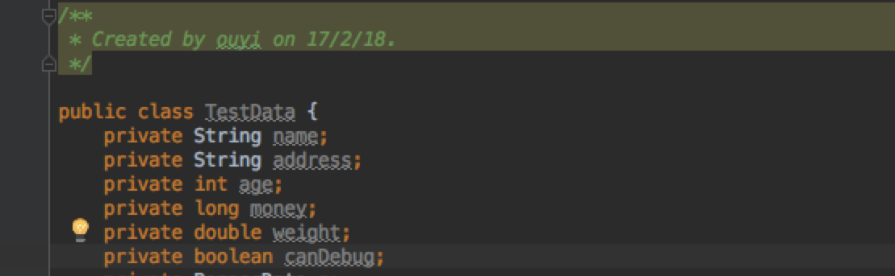
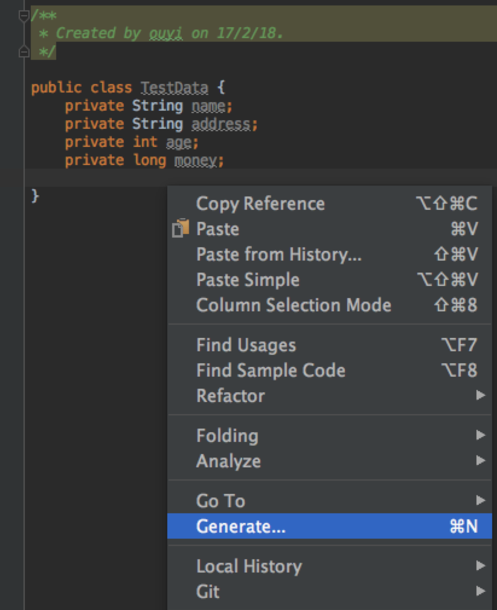
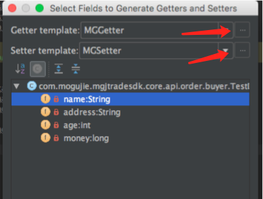
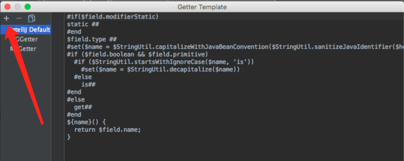
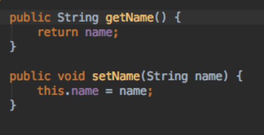
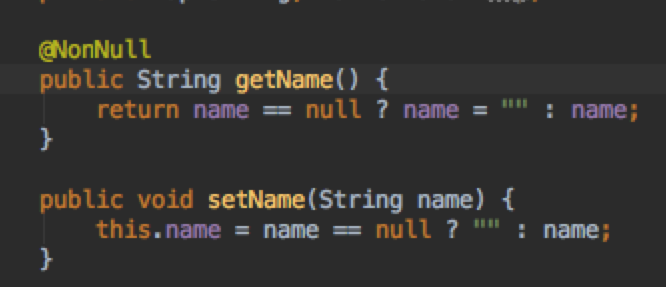
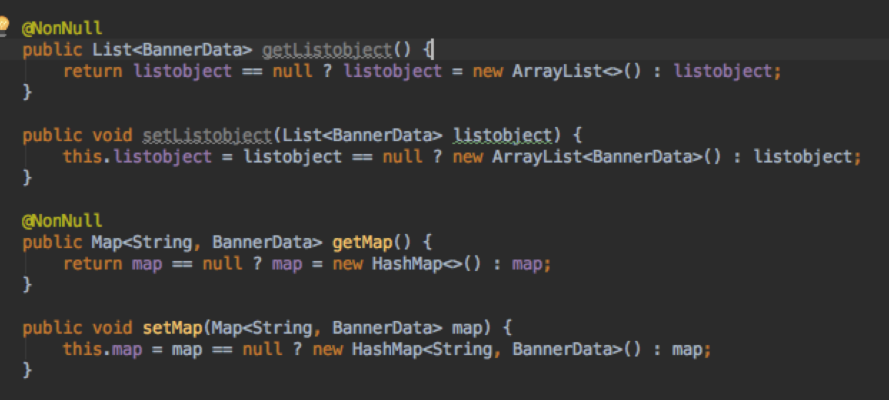

###DTO Getter/Setter模板二十秒接入说明
* #####规范 应该注意DTO内的成员变量的访问权限,除了特殊情况应该定位private,避免破坏对象的封装性。推荐的方式是这样:

* #####AS提供一套默认模板生成成员变量的getter/setter方法
  右键-->Generate-->Getter/Setter/Getter and Setter
  
  
  
* #####新模板接入方式
  点击getter and setter-->如题所示不知怎么描述-->把模板源码帖到编辑框内-->使用时把模板指定成对应模板即可
  
  
  
  
* #####一些要点
  * 对于getter和setter可以自主选择模板
  * 对于实现list,map接口的对象,默认实例化成ArrayList和HashMap,如有其它需要比如LinkedList之类,得手动改一下
  
* #####大致效果展示
  * before:
  
  
  * after:
  
  